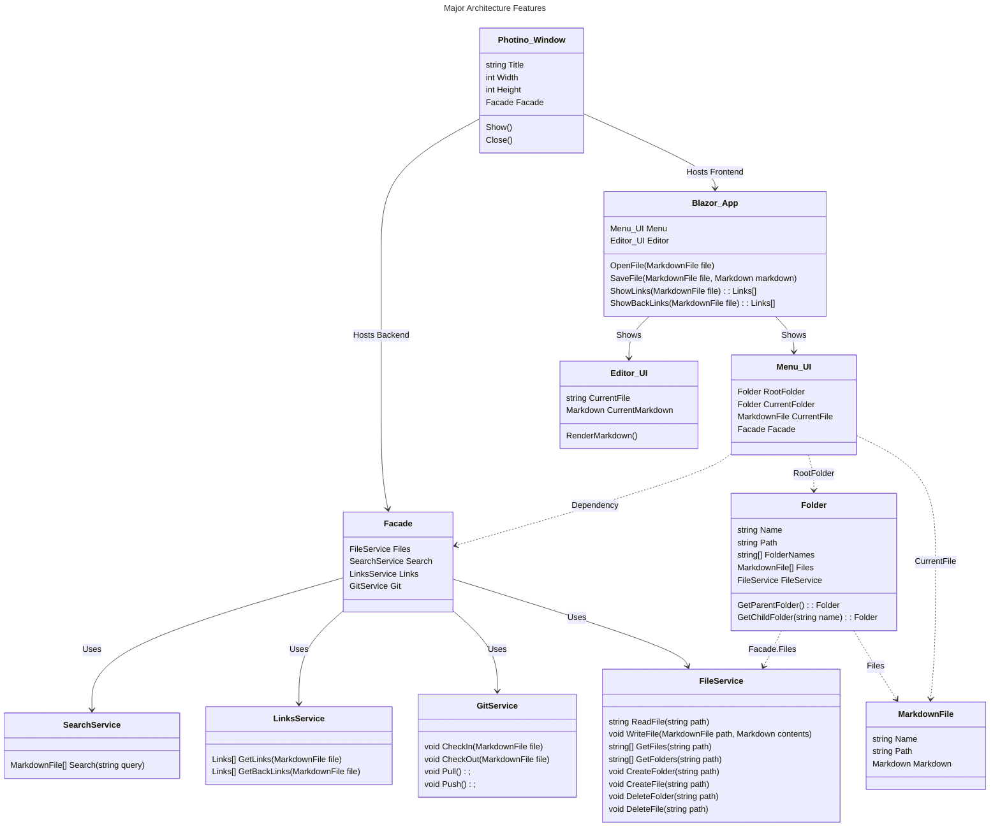

# Product Design

## Top 10 Features of this Application

These are the top 10 user-level features or use cases for the application.

1. Edit Markdown files stored on your local computer.
2. Support all of the Markdown features in the same way that GitHub does.
   1. This is also called "GitHub Flavored Markdown" or GFM.
   2. Consider [GFM Spec](https://github.github.com/gfm/) for details.
3. It should be a sort-of WYSIWYG editor for Markdown files.
   1. Text and images should be displayed per GFM rules while editing.
   2. The editor should be able to display the rendering Markdown format codes onscreen, but they should be rendered in a "greyed out" color to indicate they will not be visible to the end user.
   3. Note, we expect this to work more or less like it does when editing Markdown text in the Discord chat application.
4. Check those markdown files in/out from a Git repository.
5. Manage images to include in the Markdown files as a sub-folder under the file.
6. Build an index of Markdown files so we can show links and back-links in the UI.
7. Ensure that links between Markdown files allow navigation between them even after uploading to GitHub.

## Major Architecture Features of this Application

The application is intended to run on a local computer and interact with the local file system. It will also interact with a Git repository to check files in and out. The application will be built using the following technologies:

